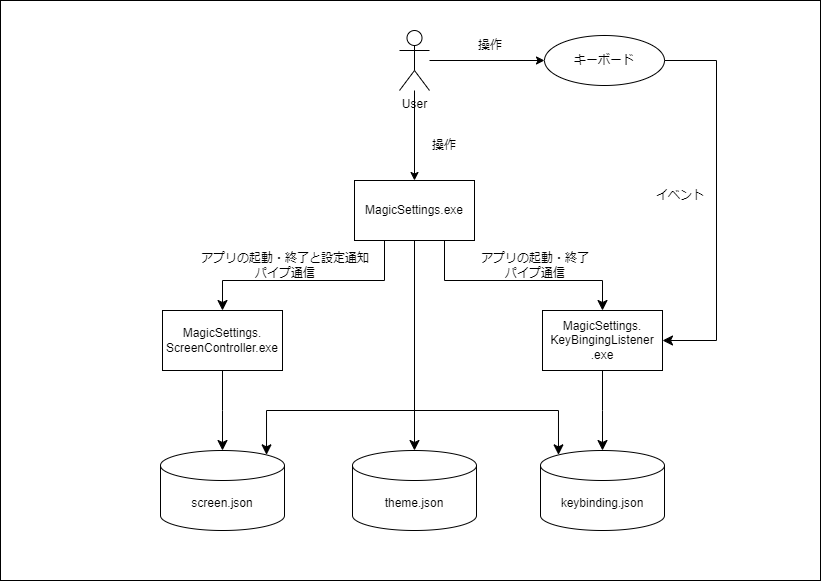

# Magic Settings

<!-- TOC tocDepth:2..3 chapterDepth:2..6 -->

- [1. 機能概要](#1-機能概要)
- [2. 動作環境](#2-動作環境)
  - [2.1. OS](#21-os)
- [3. 機能詳細](#3-機能詳細)
  - [3.1. キーバインディング機能](#31-キーバインディング機能)
  - [3.2. ブルーライトカット機能](#32-ブルーライトカット機能)
  - [3.3. アプリの設定](#33-アプリの設定)
- [4. 基本設計](#4-基本設計)
- [5. 詳細設計](#5-詳細設計)
  - [5.1. MagicSettings.exe](#51-magicsettingsexe)
  - [5.2. MagicSettings.ScreenControll.exe](#52-magicsettingsscreencontrollexe)
  - [5.3. MagicSettings.KeyBindingListener.exe](#53-magicsettingskeybindinglistenerexe)
  - [5.4. ProcessManager ライブラリ](#54-processmanager-ライブラリ)
  - [5.5. MagicSettings.Repositories ライブラリ](#55-magicsettingsrepositories-ライブラリ)
  - [5.6. 設定ファイル](#56-設定ファイル)
- [6. 開発環境](#6-開発環境)
  - [6.1. PC](#61-pc)
  - [6.2. ツール](#62-ツール)

<!-- /TOC -->

## 1. 機能概要

Magic Settings とは、OS の設定にはない便利な機能を提供する Windows アプリケーションである。


## 2. 動作環境

### 2.1. OS

- Windows 10 Version 1809 以上
- Windows 11 Version 21H2 以上

## 3. 機能詳細

GUI は大きく、メニュー部とコンテンツ部の二つの領域に分かれている。


| 番号 | 名前             | 説明                                 |
| :--- | ---------------- | :----------------------------------- |
| (1)  | メニュー         | 項目を選択するとそのページに遷移する |
| (2)  | メインコンテンツ | 設定ページなどを切り替えて表示する   |

### 3.1. キーバインディング機能

キーバインディングとは、特定のキーの組み合わせにアクションを割り当てることである。  
本機能は、設定したキーの組み合わせを押下することで設定したアクションを実行することができる。  
キーの組み合わせは Win キー + Alt キー + 設定したいキーとなる。  
Win キー + Alt キーを固定にしているのは、他のアプリのショートカットとの競合をなるべく避けるためである。
すでに設定したキーの組み合わせが他のアプリで設定されている場合、アクションが実行されないことがある。  
(そのアプリの仕様によって実行されるされないが変わる)
本アプリで設定したキーの組み合わせを押下したとき、本アプリ以外のアプリもキー押下を検出出来るようにしているため、  
本アプリ以外のアクションも実行されることがある。
同じキーの組合せで割り当てられるアクションは一つのみ。  
既に設定されているキーの組み合わせを再度新規で設定しようとした場合はエラーメッセージを表示する。

#### 3.1.1. GUI


| 番号 | 名前                                    | 説明                                                                                                                                                                           |
| :--- | --------------------------------------- | :----------------------------------------------------------------------------------------------------------------------------------------------------------------------------- |
| (1)  | キーバインディングを有効にする スイッチ | 項目を選択するとそのページに遷移する。                                                                                                                                         |
| (2)  | 新しいキーバインディングを追加 ボタン   | 新しいキーバインディングを追加するためのキーバインディング設定ダイアログを表示する。                                                                                           |
| (3)  | キーバインディング カード               | 設定したキーの情報を表示する。一番左にはキーの情報、その右隣りは設定したアクションの情報を表示する。 <br> カード自体を選択するとキーバインディングを編集ダイアログを表示する。 |
| (4)  | キーバインディング スイッチ             | 設定したキーバインディングを有効にするかどうかを設定する。                                                                                                                     |
| (5)  | オプション                              | 各キーバインディングに対するオプションを表示する。                                                                                                                             |

---


| 番号 | 名前                    | 説明                                                                                           |
| :--- | ----------------------- | :--------------------------------------------------------------------------------------------- |
| (1)  | オプション フライアウト | 編集: キーバインディングを編集ダイアログを表示する。 <br> 削除: キーバインディングを削除する。 |

---


| 番号 | 名前                      | 説明                           |
| :--- | ------------------------- | :----------------------------- |
| (1)  | キー入力 テキストボックス | 割り当てるキーを設定する。     |
| (2)  | アクション コンボボックス | 実行するアクションを設定する。 |

---


| 番号 | 名前                                  | 説明                                                                                                                                                                          |
| :--- | ------------------------------------- | :---------------------------------------------------------------------------------------------------------------------------------------------------------------------------- |
| (1)  | プログラムパスの選択 テキストボックス | 起動するプログラムを選択する。 <br> ファイルを選択する ボタンを押下するとファイルピッカーを開く。 <br> ファイルが存在しているもののみ設定が可能。(拡張子まではチェックしない) |

---


| 番号 | 名前                 | 説明                                                                                            |
| :--- | -------------------- | :---------------------------------------------------------------------------------------------- |
| (1)  | URL テキストボックス | 表示する Web ページの URL を選択する。 <br> http:もしくは https:から始まる URL のみ設定が可能。 |

#### 3.1.2. 設定できるアクション

| アクション                 | 説明                                                      | オプション                                          |
| :------------------------- | :-------------------------------------------------------- | :-------------------------------------------------- |
| アプリの起動               | オプションで設定したアプリを起動する。                    | 起動するファイルのパス                              |
| Web ページを表示           | 既定のブラウザアプリで、オプションで設定した URL を開く。 | URL (http:または https:から始まる URL のみ設定可能) |
| スクリーンショット         | スクリーンショットを実行する。                            |                                                     |
| Snipping Tool の起動       | Snipping Tool を起動する。                                |                                                     |
| Microsoft Store を起動     | Microsoft Store を起動する。                              |                                                     |
| 設定アプリの起動           | 設定アプリを起動する。                                    |                                                     |
| Bluetooth デバイスの設定   | 設定アプリの Bluetooth デバイス設定ページを開く。         |                                                     |
| カメラの設定               | 設定アプリのカメラ設定ページを開く。                      |                                                     |
| マウスの設定               | 設定アプリのマウス設定ページを開く。                      |                                                     |
| キーボードの設定           | 設定アプリのキーボード設定ページを開く。                  |                                                     |
| ネットワークの設定         | 設定アプリのネットワーク設定ページを開く。                |                                                     |
| Wi-Fi の設定               | 設定アプリの Wi-Fi 設定ページを開く。                     |                                                     |
| システム情報を表示         | 設定アプリのシステム情報ページを開く。                    |                                                     |
| アプリごとのボリューム設定 | 設定アプリのアプリごとのボリューム設定ページを開く。      |                                                     |
| バッテリー節約機能         | 設定アプリのバッテリー節約機能を開く。                    |                                                     |
| バッテリー節約機能の設定   | 設定アプリのバッテリー節約機能設定ページを開く。          |                                                     |
| バッテリーの使用状況       | 設定アプリのバッテリーの使用状況ページを開く。            |                                                     |
| ディスプレイ設定           | 設定アプリのディスプレイ設定ページを開く。                |                                                     |
| 集中モードの設定           | 設定アプリの集中モード設定ページを開く。                  |                                                     |
| ナイトモードの設定         | 設定アプリのナイトモード設定ページを開く。                |                                                     |
| 通知の設定                 | 設定アプリの通知設定ページを開く。                        |                                                     |
| システムサウンドの設定     | 設定アプリのシステムサウンド設定ページを開く。            |                                                     |
| サウンドデバイスの設定     | 設定アプリのサウンドデバイス設定ページを開く。            |                                                     |
| ストレージ情報を表示       | 設定アプリのストレージ情報ページを開く。                  |                                                     |

### 3.2. ブルーライトカット機能

ディスプレイのスクリーンの青色要素を軽減し、目への負担を減らす機能。  
軽減率は 10% ~ 100%の 10%刻みで設定が可能。

#### 3.2.1. GUI


| 番号 | 名前                        | 説明                                                                                   |
| :--- | --------------------------- | :------------------------------------------------------------------------------------- |
| (1)  | ブルーライトカット スイッチ | ブルーライトカットの有効無効を設定する。                                               |
| (2)  | 軽減率 スライダー           | ブルーライトカットの軽減率(%)を設定する。 スライダーの設定はスロットル制限をしている。 |

### 3.3. アプリの設定

本ページには、アプリ情報表示機能、アプリのテーマ設定機能、OSS ライセンス表示機能がある。  
OSS ライセンス表示は、ライセンスの条件に従い、各 OSS のライセンス本文を表示している。

#### 3.3.1. GUI


| 番号 | 名前                        | 説明                                                  |
| :--- | --------------------------- | :---------------------------------------------------- |
| (1)  | アプリ情報                  | アプリの基本情報を表示する。                          |
| (2)  | アプリのテーマ ラジオボタン | アプリのテーマ設定をする。                            |
| (3)  | OSS ライセンス情報          | アプリで使用している OSS のライセンス情報を表示する。 |

## 4. 基本設計

本アプリは一つの GUI アプリと二つのバックグラウンドプロセスで成り立っている。

| アプリ名                             |
| :----------------------------------- |
| MagicSettings.exe                    |
| MagicSettings.ScreenControll.exe     |
| MagicSettings.KeyBindingListener.exe |



## 5. 詳細設計

### 5.1. MagicSettings.exe

ユーザーからの入力を受け付ける役割を担う GUI アプリケーション。  
バックグラウンドプロセスの起動と終了、設定更新通知を ProcessManager ライブラリを利用して行う。  
多重起動はしない。

#### 5.1.1. 基本情報

- Windows デスクトップアプリケーション
- WinUI3
- .NET 8
- C# 12

### 5.2. MagicSettings.ScreenControll.exe

多重起動はしない。  
スクリーンの設定を実行するバックグラウンドプロセス。  
終了命令と、設定更新通知を受け取れるようにするため、メインスレッドとは別のスレッドでパイプを作成する。  
プロセス開始時に、設定ファイル(screen.json)から情報を取得して動作する。  
このプロセスが終了すると、スクリーンの設定も解除されるため、プロセス終了時に設定ファイル(screen.json)の有効無効設定を無効に更新する。

#### 5.2.1. 基本情報

- Windows デスクトップアプリケーション
- Win32
- C++ 20

### 5.3. MagicSettings.KeyBindingListener.exe

多重起動はしない。  
キーイベントを監視して、設定されているキーバインディングを実行するバックグラウンドプロセス。  
終了命令を受け取れるようにするため、メインスレッドとは別のスレッドでパイプを作成する。
このプロセスが終了すると、キーイベントが受け取れなくなるため、プロセス終了時に設定ファイル(keybindig.json)の有効無効設定を無効に更新する。
Win キー、Alt キーのキーダウンイベントを受け取った場合、それぞれのキーのフラグを立てる。  
Win キー、Alt キーのキーアップイベントを受け取った場合、それぞれのキーのフラグを降ろす。  
Win キー、Alt キー以外のキーダウンイベントを受け取った場合、Win キーフラグと Alt キーフラグが立っているときのみ、設定ファイル(keybindig.json)から情報を取得してキーバインディングの動作をする。

#### 5.3.1. 基本情報

- Windows デスクトップアプリケーション
- WPF (ただしウィンドウは非表示)
- .NET 8
- C# 12

### 5.4. ProcessManager ライブラリ

プロセス間パイプ通信やプロセスを管理するためのライブラリ。

#### 5.4.1. プロセス間パイプ通信のルール

プロセス間パイプ通信はリクエストメッセージとレスポンスメッセージでやり取りを行う。  
それぞれのメッセージは json 文字列を一行にしたもので、基本的には 1 リクエスト 1json 文字列を送信する。

##### 5.4.1.1. リクエストメッセージ

| 階層 1 | 説明                 | 値     |
| ------ | :------------------- | ------ |
| Cmd    | コマンド             | 文字列 |
| Args   | コマンドに対する引数 | 文字列 |

例(見やすさのため改行している)

```json
{
  "Cmd": "Terminate",
  "Args": ""
}
```

##### 5.4.1.2. レスポンスメッセージ

| 階層 1           | 説明                               | 値                          |
| ---------------- | :--------------------------------- | --------------------------- |
| ReturnCode       | リクエストに対するリターンコード。 | 0: 成功 <br> 0 以外: エラー |
| ReturnParameters | リターンコードの追加情報。         | 文字列                      |

例(見やすさのため改行している)

```json
{
  "ReturnCode": 0,
  "ReturnParameters": ""
}
```

#### 5.4.2. プロセスの起動機能

プロセスの起動はファイルを指定して、起動する。  
起動した後は、そのプロセスに対して Check コマンドのリクエストメッセージでプロセス間パイプ通信をし、正常に起動したかを確認する。

#### 5.4.3. プロセスの終了機能

プロセスの終了は終了させたいプロセスに対して Terminate コマンドのリクエストメッセージでプロセス間パイプ通信をし、各プロセスに終了処理を促す。

#### 5.4.4. 各プロセスへのリクエストメッセージ機能

各プロセスに対して リクエストメッセージを送信する。

### 5.5. MagicSettings.Repositories ライブラリ

各設定ファイルにアクセスするためのライブラリ。

### 5.6. 設定ファイル

設定ファイルは MagicSettings.exe のフォルダ下にある`Settings`フォルダに保存される。

| ファイル名     | 説明                                                  |
| -------------- | :---------------------------------------------------- |
| keybindig.json | アプリのテーマ設定をする。                            |
| screen.json    | アプリで使用している OSS のライセンス情報を表示する。 |
| theme.json     | アプリの基本情報を表示する。                          |

#### 5.6.1. keybindig.json

MagicSettings.exe と MagicSettings.KeyBindingListener.exe が利用する。  
キーバインディング設定を保存する。

| 階層 1                   | 階層 2    | 階層 3      | 説明                                          | 設定値                         |
| ------------------------ | --------- | ----------- | :-------------------------------------------- | ------------------------------ |
| IsEnabledKeyboardBinding |           |             | キーバインディング機能の有効無効設定          | false: 無効 <br> true: 有効    |
| KeyboardActions          |           |             | キーバインディングの設定                      |                                |
|                          | {KeyCode} |             | キーのコード                                  | Windows が認識するキーのコード |
|                          |           | ActionType  | キーに割り当てられたアクション                | KeyboardActionType enum の数値 |
|                          |           | IsEnabled   | キーのアクションの有効無効設定                | false: 無効 <br> true: 有効    |
|                          |           | ProgramPath | アプリの起動 アクションで利用するアプリのパス | アプリのパス                   |
|                          |           | Url         | Web ページを表示 アクションで利用する URL     | URL                            |

例

```json
{
  "IsEnabledKeyboardBinding": false,
  "KeyboardActions": {
    "65": {
      "ActionType": 0,
      "IsEnabled": true,
      "ProgramPath": "C:\\Windows\\explorer.exe",
      "Url": "https://www.google.com"
    }
  }
}
```

#### 5.6.2. screen.json

MagicSettings.exe と MagicSettings.ScreenControll.exe が利用する。  
ブルーライトカットなどのスクリーンの設定を保存する。

| 階層 1                     | 説明                                 | 設定値                      |
| -------------------------- | :----------------------------------- | --------------------------- |
| IsEnabledBlueLightBlocking | ブルーライトカット機能の有効無効設定 | false: 無効 <br> true: 有効 |
| BlueLightBlocking          | ブルーライトカットの軽減率           | 10~100 の 10 刻み           |

例

```json
{
  "IsEnabledBlueLightBlocking": false,
  "BlueLightBlocking": 20
}
```

#### 5.6.3. theme.json

MagicSettings.exe が利用する。  
アプリのテーマ設定を保存する。

| 階層 1 | 説明       | 設定値                                                   |
| ------ | :--------- | -------------------------------------------------------- |
| Theme  | テーマ情報 | 0: System の設定に合わせる <br> 1: ダーク <br> 2: ライト |

例

```json
{
  "Theme": 1
}
```

## 6. 開発環境

### 6.1. PC

動作確認も本 PC で実施

- Windows 11 Version 23H2
- CPU Intel(R) Core(TM) i7-10700K CPU @ 3.80GHz
- メモリ 64GB

### 6.2. ツール

- Visual Studion 2022 Community
  - 開発で利用
- Visual Studio Code
  - Git 操作で利用
  - ドキュメント作成で利用
- Git
  - ホスティングサービスは Github
  - Ci のために Github Actions を使用
